# Praktikum 2 - CRUD KTP

## Deskripsi
Project ini merupakan aplikasi CRUD data KTP menggunakan:
- Spring Boot
- MySQL
- Spring Data JPA
- HTML
- CSS
- JavaScript
- Ajax jQuery

Aplikasi ini memiliki fitur:
- tambah data KTP
- lihat seluruh data KTP
- lihat data KTP berdasarkan id
- edit data KTP
- hapus data KTP

---

## Database
Schema: `spring`  
Table: `ktp`

Kolom:
- `id` : INT, Primary Key, Auto Increment
- `nomorKtp` : VARCHAR, Unique
- `namaLengkap` : VARCHAR
- `alamat` : VARCHAR
- `tanggalLahir` : DATE
- `jenisKelamin` : VARCHAR

---

## Struktur Package
Package yang digunakan:
- `model`
- `entity`
- `dto`
- `repository`
- `service`
- `impl`
- `util`
- `mapper`
- `controller`

---

## Endpoint API

### 1. POST /ktp
Digunakan untuk menambah data KTP baru.

**Request Body**
```json
{
  "nomorKtp": "3276010101010001",
  "namaLengkap": "Haechan",
  "alamat": "Jl. Mawar No. 10",
  "tanggalLahir": "2001-06-15",
  "jenisKelamin": "Laki-laki"
}
```

**Response Success**
```json
{
  "message": "Data KTP berhasil ditambahkan",
  "data": {
    "id": 1,
    "nomorKtp": "3276010101010001",
    "namaLengkap": "Haechan",
    "alamat": "Jl. Mawar No. 10",
    "tanggalLahir": "2001-06-15",
    "jenisKelamin": "Laki-laki"
  }
}
```

### 2. GET /ktp
Digunakan untuk mengambil seluruh data KTP.

**Response Success**
```json
{
  "message": "Berhasil mengambil seluruh data KTP",
  "data": [
    {
      "id": 1,
      "nomorKtp": "3276010101010001",
      "namaLengkap": "Haechan",
      "alamat": "Jl. Mawar No. 10",
      "tanggalLahir": "2001-06-15",
      "jenisKelamin": "Laki-laki"
    }
  ]
}
```

### 3. GET /ktp/{id}
Digunakan untuk mengambil data KTP berdasarkan id.

**Response Success**
```json
{
  "message": "Berhasil mengambil data KTP",
  "data": {
    "id": 4,
    "nomorKtp": "3276010101010001",
    "namaLengkap": "Haechan",
    "alamat": "Jl. Mawar No. 10",
    "tanggalLahir": "2001-06-15",
    "jenisKelamin": "Laki-laki"
  }
}
```

**Response Failed**
```json
{
  "message": "Data KTP dengan id 99 tidak ditemukan"
}
```

### 4. PUT /ktp/{id}
Digunakan untuk memperbarui data KTP berdasarkan id.

**Request Body**
```json
{
  "nomorKtp": "3276010101010001",
  "namaLengkap": "Zhang Linghe",
  "alamat": "Jl. Melati No. 20",
  "tanggalLahir": "2001-06-15",
  "jenisKelamin": "Laki-laki"
}
```

**Response Success**
```json
{
  "message": "Data KTP berhasil diperbarui",
  "data": {
    "id": 1,
    "nomorKtp": "3276010101010001",
    "namaLengkap": "Zhang Linghe",
    "alamat": "Jl. Melati No. 20",
    "tanggalLahir": "2001-06-15",
    "jenisKelamin": "Laki-laki"
  }
}
```

### 5. DELETE /ktp/{id}
Digunakan untuk menghapus data KTP berdasarkan id.

**Response Success**
```json
{
  "message": "Data KTP berhasil dihapus",
  "data": null
}
```

## Screenshot

### Halaman Utama
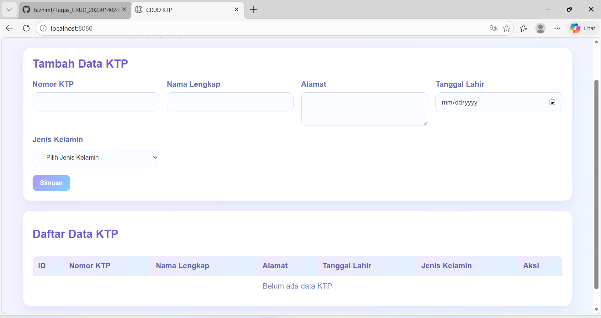

### Tambah Data
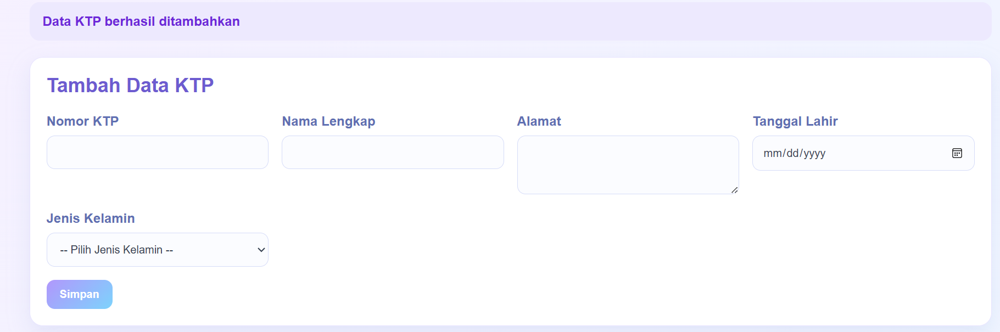

### Data Berhasil Ditambahkan
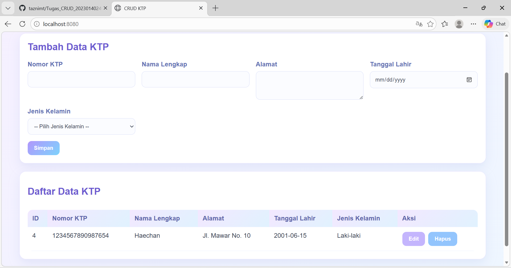

### Edit Data
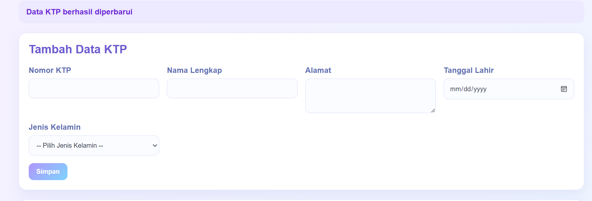

### Data Berhasil Diedit
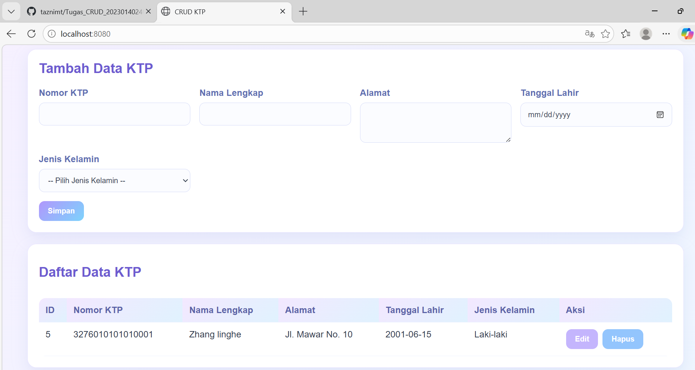

### Hapus Data
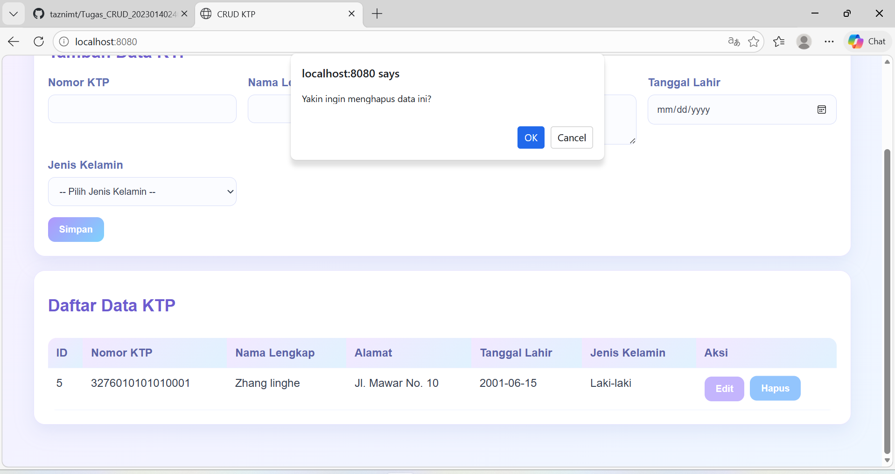

### Data Berhasil Dihapus
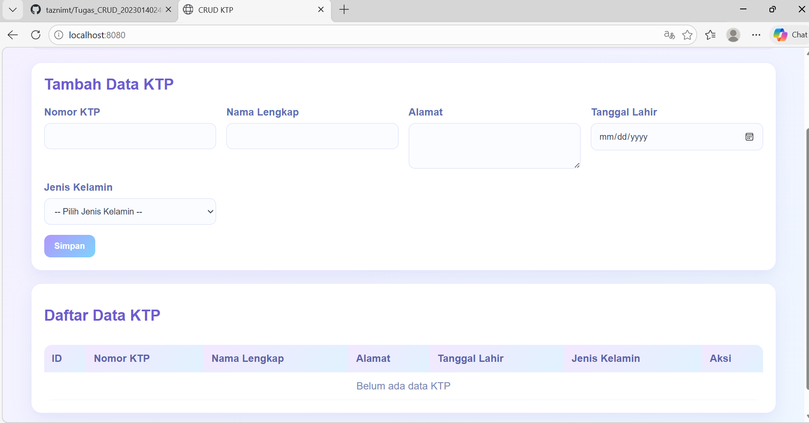

### Format Date
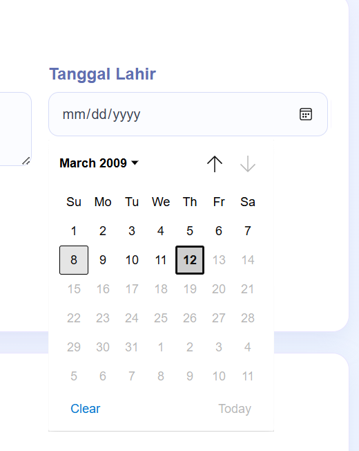

### Dropdown Jenis Kelamin
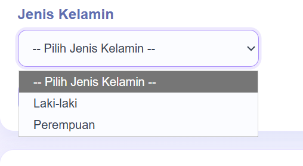

### No KTP Wajib Diisi
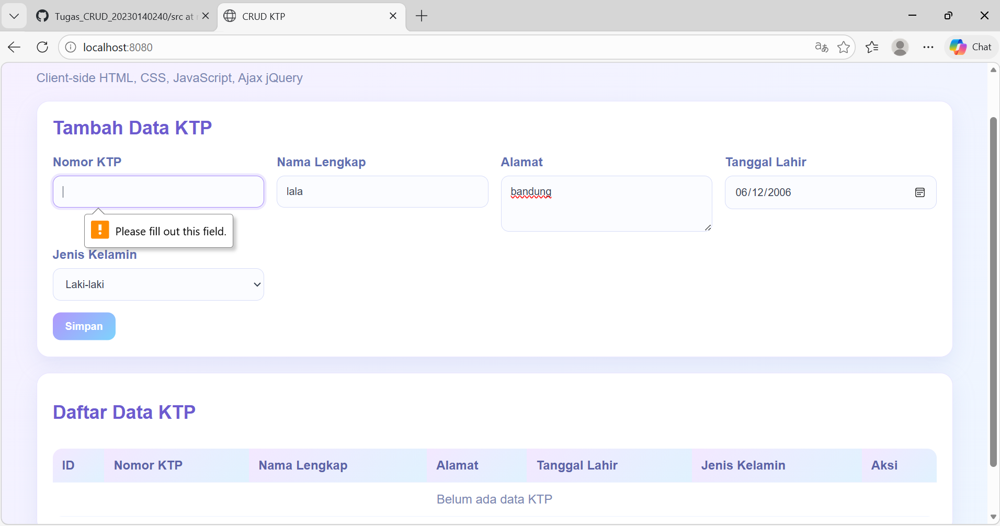

### No KTP Harus 16 Digit
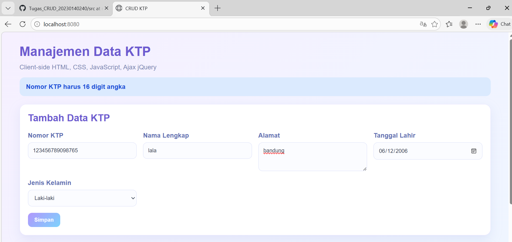

### No KTP Sudah Ada
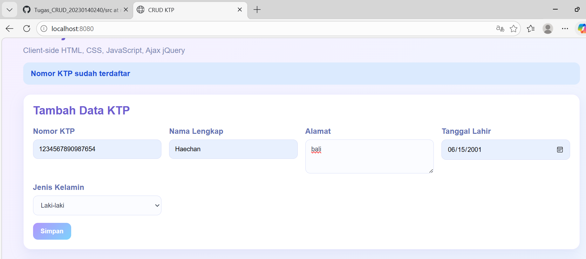

### Nama Lengkap Wajib Diisi
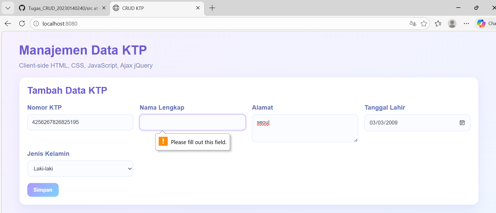

### Alamat Wajib Diisi
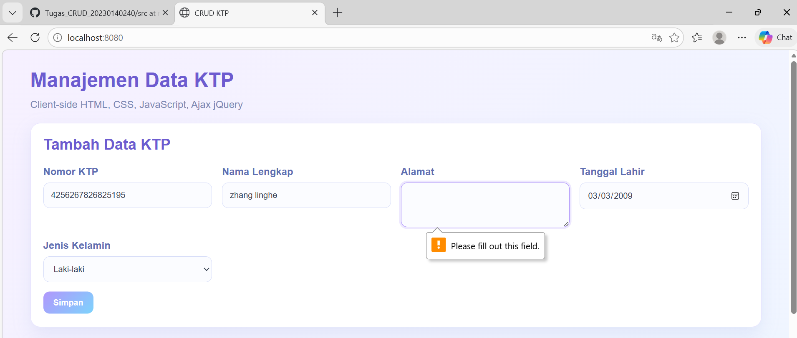

### Tanggal Lahir Wajib Diisi
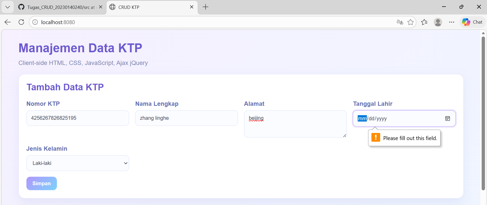

### Database
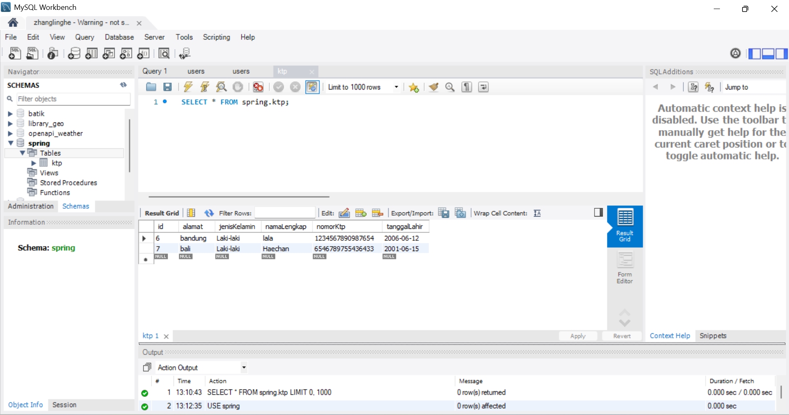

### Database 1
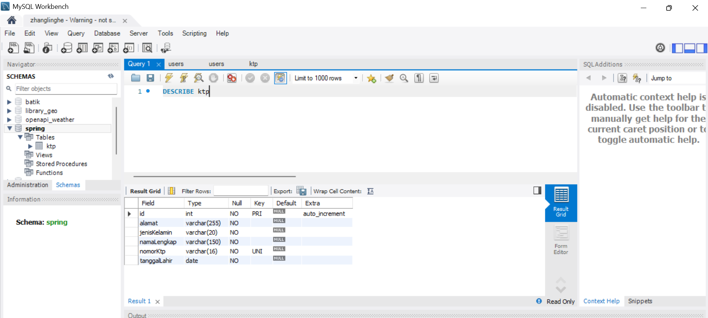
